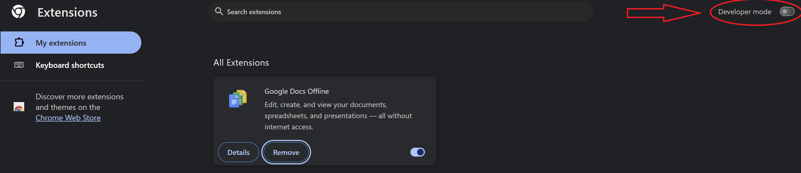
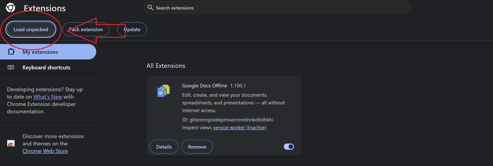
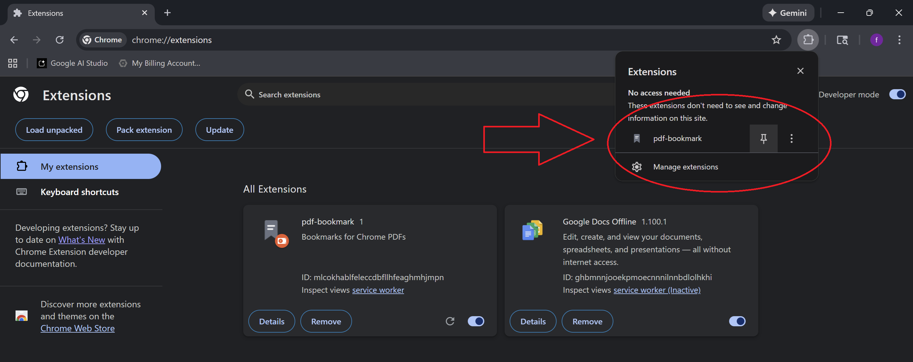

# PDF Page Bookmarker

Chrome extension to help you bookmark pages in Chrome-native PDFs
Create and manage multiple bookmarks, saved between sessions

## Features

- **Create Bookmarks**: Add bookmarks to any page in a PDF with custom names
- **Color Coding**: Assign colors to bookmarks for easy organization
- **Quick Navigation**: Click any bookmark to jump directly to that page
- **Edit & Delete**: Easily modify or remove bookmarks
- **Persistent Storage**: Bookmarks are saved locally and persist across sessions
- **Per-PDF Organization**: Bookmarks are organized by PDF file

## Installation

1. Clone this repository
```bash
git clone https://github.com/davidmenggx/pdf-bookmark
```

2. Open Chrome and navigate to `chrome://extensions/`

3. Enable **Developer mode** by toggling the switch in the top-right corner<br><br>


4. Click **Load unpacked** button<br><br>


5. Select the `pdf-bookmark-extension` folder

6. The extension icon will appear in your toolbar<br><br>


