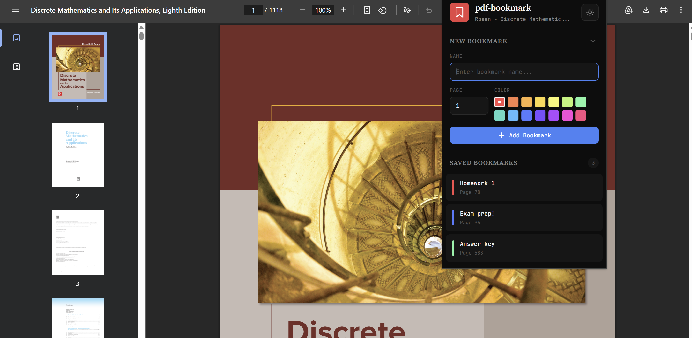

# PDF Page Bookmarker

Chrome extension to help you bookmark pages in Chrome native PDFs
Create and manage multiple bookmarks, saved between sessions

## Features

- **Create Bookmarks**: Add bookmarks to any page in a PDF with custom names
- **Color Coding**: Assign colors to bookmarks for easy organization
- **Quick Navigation**: Click any bookmark to jump directly to that page
- **Edit & Delete**: Easily modify or remove bookmarks
- **Persistent Storage**: Bookmarks are saved locally and persist across sessions
- **Per-PDF Organization**: Bookmarks are organized by PDF file

## Installation

1. Clone this repository
```bash
git clone https://github.com/davidmenggx/pdf-bookmark
```

2. Open Chrome and navigate to `chrome://extensions/`

3. Enable **Developer mode** by toggling the switch in the top right corner<br><br>


4. Click **Load unpacked** button<br><br>


5. Select the `pdf-bookmark` folder

6. The extension icon will appear in your toolbar<br><br>


## Usage

### Adding a Bookmark

1. Open any PDF file in Chrome
2. When a PDF is detected, the extension icon will turn red
3. Click the extension icon in your toolbar
4. Enter a name for your bookmark (optional, defaults to page number)
5. Adjust the page number if needed (defaults to current page)
6. Select a color for the bookmark
7. Click "Add Bookmark"



### Navigating to a Bookmark

Click on any bookmark in the list to jump directly to that page.

### Editing a Bookmark

1. Hover over a bookmark to reveal action buttons
2. Click the edit (pencil) icon
3. Modify the name, page, or color
4. Click "Save Changes"

### Deleting a Bookmark

1. Hover over a bookmark
2. Click the delete (trash) icon

Or right click on a bookmark to access the context menu.

## Permissions

- **storage**: To save your bookmarks locally
- **activeTab**: To interact with the current PDF tab
- **scripting**: To detect page numbers and navigate within PDFs

## Privacy

All bookmarks are stored locally on your device

## License

MIT

